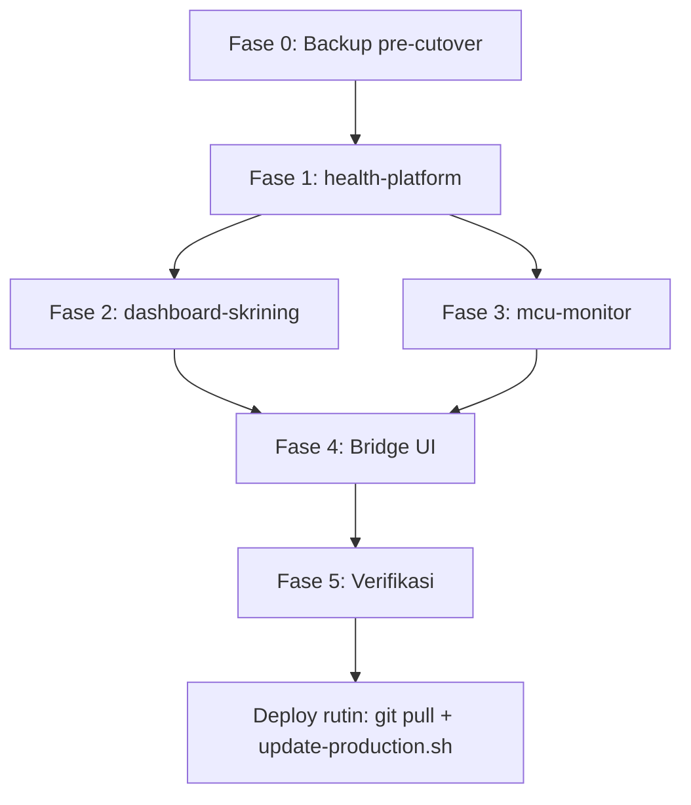

# Panduan lengkap: instalasi & migrasi MySQL → PostgreSQL

Dokumen **utama** untuk setup stack PPKP DKI dari nol sampai produksi, termasuk migrasi database ke **health-platform** (PostgreSQL bersama).

| Lingkungan | VM / host contoh |
|------------|------------------|
| **Produksi** | `10.15.101.117` |
| **Lokal dev** | Windows + Docker Desktop (`E:\laragon\www\`) |

---

## Isi

1. [Ringkasan arsitektur](#1-ringkasan-arsitektur)
2. [Tiga repository](#2-tiga-repository)
3. [Prasyarat](#3-prasyarat)
4. [Konvensi password & database](#4-konvensi-password--database)
5. [Fase 0 — Backup & persiapan (produksi)](#5-fase-0--backup--persiapan-produksi)
6. [Fase 1 — health-platform (infra)](#6-fase-1--health-platform-infra)
7. [Fase 2 — dashboard-skrining (SIKERJA)](#7-fase-2--dashboard-skrining-sikerja)
8. [Fase 3 — mcu-monitor](#8-fase-3--mcu-monitor)
9. [Fase 4 — Bridge CKG ↔ MCU](#9-fase-4--bridge-ckg--mcu)
10. [Fase 5 — Verifikasi akhir](#10-fase-5--verifikasi-akhir)
11. [Deploy rutin setelah migrasi](#11-deploy-rutin-setelah-migrasi)
12. [pgAdmin, backup, rollback](#12-pgadmin-backup-rollback)
13. [Troubleshooting](#13-troubleshooting)
14. [Copy-paste cepat](#14-copy-paste-cepat)

**Dokumen pendukung:**

| Topik | File |
|-------|------|
| Port host vs container | [PORTS.md](./PORTS.md) |
| Penamaan DB/user | [DATABASE-NAMING.md](./DATABASE-NAMING.md) |
| Mapping `.env` | [APP-ENV.md](./APP-ENV.md) |
| Deploy harian & subdomain | [PRODUCTION-DEPLOY-WORKFLOW.md](./PRODUCTION-DEPLOY-WORKFLOW.md) |
| Setup lokal (ringkas) | [SETUP-FROM-SCRATCH.md](./SETUP-FROM-SCRATCH.md) |
| Detail produksi infra | [PRODUCTION.md](./PRODUCTION.md) |

---

## 1. Ringkasan arsitektur

```
                    ┌─────────────────────────────────────────┐
  Browser / ASN     │  VM 10.15.101.117                     │
       │            │                                         │
       ▼            │  nginx host (tidak diubah saat migrasi) │
  puspelkes.../     │    /sikerja/  ──► :9006 dashboard     │
  sikerja/          │    /mcuppkp/  ──► :9003 mcu-monitor    │
                    │                                         │
                    │  health-platform (network ppkp-data)    │
                    │    ppkp-postgres  ← sikerja_ppkp        │
                    │                   ← mcu_monitor         │
                    │    ppkp-pgadmin   127.0.0.1:5050        │
                    │    ppkp-redis     127.0.0.1:6380        │
                    │    ppkp-minio     127.0.0.1:9200        │
                    └─────────────────────────────────────────┘

Bridge CKG → MCU: HTTP API (bukan shared database)
  dashboard :9006/api/bridge/mcu/*  ──►  mcu-monitor
```

**Yang berubah saat migrasi:** hanya lapisan database (MySQL → PostgreSQL di `ppkp-postgres`).

**Yang tidak berubah:** URL publik, nginx host, `APP_URL`, `APP_SUBPATH`, port `9006` / `9003`, workflow `git pull` + `update-production.sh`.

---

## 2. Tiga repository

| Repo | Path produksi (contoh) | Peran |
|------|------------------------|-------|
| **health-platform** | `/var/www/html/healty-platform` | PostgreSQL, pgAdmin, Redis, MinIO |
| **dashboard-skrining** | `/var/www/html/dashboard-skrining` | CKG / SIKERJA, port `9006` |
| **mcu-monitor** | `/var/www/html/mcu-monitor` | Monitoring MCU, port `9003` |

Clone (GitHub):

```bash
cd /var/www/html
git clone https://github.com/fadil0701/healty-platform.git healty-platform
git clone <repo-dashboard-skrining> dashboard-skrining
git clone <repo-mcu-monitor> mcu-monitor
```

---

## 3. Prasyarat

### Produksi VM

| Item | Keterangan |
|------|------------|
| OS | Linux (Ubuntu/Debian) |
| Docker | Engine + Compose plugin v2+ |
| Git | Clone 3 repo |
| Port LAN | `9006`, `9003` terbuka untuk aplikasi |
| Port infra | `5435`, `5050`, `6380`, `9100`, `9200` — bind **127.0.0.1** saja |
| Paket opsional | `postgresql-client` (backup host): `apt install postgresql-client` |
| Maintenance | Jadwal ±1–2 jam untuk cutover |

### Lokal Windows

| Item | Keterangan |
|------|------------|
| Docker Desktop | Aktif |
| Repo sibling | `health-platform`, `dashboard-skrining`, `mcu-monitor` di folder yang sama |
| Port bebas | `5432`, `6379`, `9006`, `9003`, `5050` |

---

## 4. Konvensi password & database

### Mapping password (wajib sinkron)

| health-platform `.env` | dashboard-skrining `.env` | mcu-monitor `.env` |
|----------------------|---------------------------|---------------------|
| `DASHBOARD_DB_PASSWORD` | `PGSQL_PASSWORD` | — |
| `MCU_DB_PASSWORD` | — | `PGSQL_PASSWORD` |

### Koneksi dari container aplikasi

| Aplikasi | `PGSQL_HOST` | `PGSQL_PORT` | Database | User |
|----------|--------------|--------------|----------|------|
| dashboard-skrining | `sikerja-postgres` | `5432` | `sikerja_ppkp` | `sikerja` |
| mcu-monitor | `mcu-monitor-postgres` | `5432` | `mcu_monitor` | `mcu_monitor` |

> **`PGSQL_PORT=5432`** selalu port **internal Docker**, bukan `5435` (port host VM untuk DBA).

### Variabel produksi yang **jangan diganti** saat cutover

Pertahankan dari `.env` lama:

```env
APP_KEY=base64:...
APP_URL=https://puspelkes.jakarta.go.id/sikerja   # dashboard
APP_SUBPATH=/sikerja
SESSION_PATH=/sikerja/
APP_PORT=9006
```

```env
APP_KEY=base64:...
APP_URL=https://puspelkes.jakarta.go.id/mcuppkp   # mcu
SESSION_PATH=/mcuppkp/
APP_PORT=9003
CKG_API_BASE_URL=http://10.15.101.117:9006
```

**Tambahkan** blok PostgreSQL; jangan timpa URL/sesi di atas.

---

## 5. Fase 0 — Backup & persiapan (produksi)

Wajib sebelum cutover jika sudah ada data MySQL produksi.

### 5.1 Salin `.env` aktif

```bash
cp /var/www/html/dashboard-skrining/.env ~/backup-env-dashboard-$(date +%F)
cp /var/www/html/mcu-monitor/.env ~/backup-env-mcu-$(date +%F)
```

### 5.2 Backup pre-cutover

```bash
cd /var/www/html/healty-platform
chmod +x infrastructure/backup/*.sh scripts/*.sh

export DASHBOARD_ROOT=/var/www/html/dashboard-skrining
export MCU_ROOT=/var/www/html/mcu-monitor

./infrastructure/backup/backup-pre-cutover.sh
```

### 5.3 Salin arsip keluar VM

```bash
# Dari laptop
scp -r user@10.15.101.117:/var/www/html/healty-platform/storage/backups/pre-cutover-* ./
```

### 5.4 Rollback jika gagal

```bash
cd /var/www/html/healty-platform
export BACKUP_RESTORE_YES=1
./infrastructure/backup/restore-pre-cutover.sh storage/backups/pre-cutover-YYYYMMDD-HHMMSS
```

---

## 6. Fase 1 — health-platform (infra)

Jalankan **pertama** — membuat network `ppkp-data` dan database `sikerja_ppkp` + `mcu_monitor`.

### 6a. Produksi VM

```bash
cd /var/www/html/healty-platform
git pull origin main

cp .env.production.example .env
nano .env   # isi password kuat
```

Isi minimal di `.env`:

```env
POSTGRES_SUPERUSER=ppkp-dki
POSTGRES_SUPERUSER_PASSWORD=...
POSTGRES_PUBLISH_PORT=5435
DASHBOARD_DB_PASSWORD=...    # = PGSQL_PASSWORD dashboard nanti
MCU_DB_PASSWORD=...            # = PGSQL_PASSWORD mcu nanti
PGADMIN_EMAIL=dba@ppkp.jakarta.go.id
PGADMIN_PASSWORD=...
PGADMIN_SERVER_NAME="PPKP PostgreSQL (produksi)"
MINIO_ROOT_USER=ppkp_minio
MINIO_ROOT_PASSWORD=...
```

> Nilai dengan spasi/kurung **wajib** pakai tanda kutip, mis. `PGADMIN_SERVER_NAME="..."`.

```bash
./scripts/install-production.sh
```

Verifikasi:

```bash
docker ps --filter name=ppkp- --format 'table {{.Names}}\t{{.Status}}\t{{.Ports}}'
# ppkp-postgres: healthy, 127.0.0.1:5435->5432
# ppkp-pgadmin:  127.0.0.1:5050->80

docker network inspect ppkp-data --format '{{.Name}}'
docker exec ppkp-postgres psql -U ppkp-dki -c "\l" | grep -E 'sikerja_ppkp|mcu_monitor'

curl -fsS http://127.0.0.1:5050 >/dev/null && echo "pgAdmin OK"
```

**pgAdmin produksi:** login wajib (`SERVER_MODE=True`). Akses dari laptop:

```bash
ssh -L 5050:127.0.0.1:5050 user@10.15.101.117
# Browser laptop: http://127.0.0.1:5050/
```

Jika error `auth_source_manager` di `/login`: `./scripts/reset-pgadmin.sh`

### 6b. Lokal Windows

```powershell
cd E:\laragon\www\health-platform
Copy-Item .env.example .env
# DASHBOARD_DB_PASSWORD=dashboard_local_secret
# MCU_DB_PASSWORD=Ppkp-Dev-2026!
.\scripts\install-local.ps1
```

---

## 7. Fase 2 — dashboard-skrining (SIKERJA)

### 7a. Siapkan `.env`

**Migrasi dari MySQL existing:** edit `.env` **yang sudah ada** — tambah `PGSQL_*`, jangan ganti `APP_URL` / `APP_KEY`.

**Fresh install:**

```bash
cd /var/www/html/dashboard-skrining
cp .env.production.example .env
```

Blok PostgreSQL:

```env
DB_CONNECTION=pgsql
PGSQL_HOST=sikerja-postgres
PGSQL_PORT=5432
PGSQL_DATABASE=sikerja_ppkp
PGSQL_USERNAME=sikerja
PGSQL_PASSWORD=<sama DASHBOARD_DB_PASSWORD di health-platform>
PGSQL_SSLMODE=prefer
NO_PROXY=...,sikerja-postgres,ppkp-postgres,redis,...
```

### 7b. Install stack

```bash
chmod +x deploy/*.sh deploy/lib/*.sh
./deploy/install.sh
```

### 7c. Migrasi MySQL → PostgreSQL (sekali)

```bash
./deploy/migrate-mysql-to-pgsql.sh
```

Skrip di atas:

1. Start MySQL legacy (`--profile mysql-legacy`) sebagai sumber data
2. `migrate --database=pgsql`
3. `sikerja:migrate-mysql-to-pgsql --fresh --verify`
4. `sikerja:fix-pgsql-sequences`

Opsi: `--skip-mysql` jika MySQL sudah tidak dipakai; `--schema-only` hanya schema.

### 7d. Cutover

Pastikan `DB_CONNECTION=pgsql` di `.env`, lalu:

```bash
./deploy/update-production.sh
```

### 7e. Fresh install (tanpa data MySQL)

```bash
docker compose -f docker-compose.yml -f docker-compose.prod.yml exec app \
  php artisan migrate --force
docker compose -f docker-compose.yml -f docker-compose.prod.yml exec app \
  php artisan ckg:bootstrap-admin
```

### 7f. Lokal Windows

```powershell
cd E:\laragon\www\dashboard-skrining
.\deploy\install-migrate-pgsql.ps1 -InitEnv
# edit .env PGSQL_PASSWORD=dashboard_local_secret
.\deploy\install-migrate-pgsql.ps1
# Set DB_CONNECTION=pgsql, restart stack
```

---

## 8. Fase 3 — mcu-monitor

### 8a. Siapkan `.env`

```env
DB_CONNECTION=pgsql
PGSQL_HOST=mcu-monitor-postgres
PGSQL_PORT=5432
PGSQL_DATABASE=mcu_monitor
PGSQL_USERNAME=mcu_monitor
PGSQL_PASSWORD=<sama MCU_DB_PASSWORD di health-platform>
PGSQL_SSLMODE=prefer

CKG_API_BASE_URL=http://10.15.101.117:9006
CKG_BRIDGE_INTERNAL_HOST=10.15.101.117
CKG_BRIDGE_INTERNAL_PORT=9006
CKG_BRIDGE_DISABLE_PROXY=true
```

### 8b. Install

```bash
cd /var/www/html/mcu-monitor
chmod +x deploy/*.sh deploy/lib/*.sh
./deploy/install.sh
```

### 8c. Migrasi MySQL → PostgreSQL (sekali)

```bash
./deploy/migrate-mysql-to-pgsql.sh
```

Termasuk: `mcu:migrate-mysql-to-pgsql`, `mcu:fix-pgsql-sequences`, `ckg-bridge:verify --warn-only`.

### 8d. Cutover

```bash
./deploy/update-production.sh
```

### 8e. Stop MySQL legacy (setelah verify)

```bash
docker compose --profile mysql-legacy stop mysql
```

### 8f. Lokal Windows

```powershell
cd E:\laragon\www\mcu-monitor
.\deploy\install-migrate-pgsql.ps1 -InitEnv
.\deploy\install-migrate-pgsql.ps1
```

---

## 9. Fase 4 — Bridge CKG ↔ MCU

Bridging **HTTP API** — bukan koneksi database silang.

### Dashboard (CKG) — generate API key

1. Login super admin
2. **Integrasi → Bridging Monitoring MCU**
3. **Generate API key baru** — salin (hanya ditampilkan sekali)

Health check: `http://10.15.101.117:9006/api/bridge/mcu/health`

### MCU — tempel API key

1. **Integrasi CKG**
2. Tempel API key dari CKG
3. Simpan → **Tes koneksi**

### Verifikasi CLI

```bash
cd /var/www/html/mcu-monitor
docker compose -f docker-compose.yml -f docker-compose.prod.yml exec app \
  php artisan ckg-bridge:verify
```

Panduan lengkap: `mcu-monitor/docs/BRIDGE-AFTER-PG-MIGRATION.md`

---

## 10. Fase 5 — Verifikasi akhir

### Checklist produksi

```bash
# Infra
docker ps --filter name=ppkp-
curl -fsS http://127.0.0.1:5435 2>/dev/null || true   # postgres host (opsional)

# Aplikasi
curl -fsS http://10.15.101.117:9006/up && echo "Dashboard OK"
curl -fsS http://10.15.101.117:9003/up && echo "MCU OK"

# Database
docker compose -f docker-compose.yml -f docker-compose.prod.yml exec app \
  php artisan db:show    # di masing-masing repo

# Migrasi (jika dari MySQL)
docker compose exec app php artisan sikerja:migrate-mysql-to-pgsql --verify   # dashboard
docker compose exec app php artisan mcu:migrate-mysql-to-pgsql --verify     # mcu

# Bridge
docker compose exec app php artisan ckg-bridge:verify   # mcu
```

### Checklist manual

- [ ] Login HTTPS `https://puspelkes.jakarta.go.id/sikerja/` — CSS/JS tampil
- [ ] Login HTTPS `https://puspelkes.jakarta.go.id/mcuppkp/`
- [ ] Data peserta/sesi sesuai jumlah sebelum migrasi
- [ ] pgAdmin (SSH tunnel) — lihat `sikerja_ppkp` dan `mcu_monitor`
- [ ] Backup PG: `health-platform/infrastructure/backup/backup-all.sh`

---

## 11. Deploy rutin setelah migrasi

**Tidak perlu** `git pull` di health-platform setiap release aplikasi.

```bash
# Dashboard
cd /var/www/html/dashboard-skrining
git pull origin sistem-ppkp-terintegrasi
./deploy/update-production.sh

# MCU
cd /var/www/html/mcu-monitor
git pull origin <branch-produksi>
./deploy/update-production.sh
```

`update-production.sh` **tidak menimpa** `.env`.

Detail: [PRODUCTION-DEPLOY-WORKFLOW.md](./PRODUCTION-DEPLOY-WORKFLOW.md)

---

## 12. pgAdmin, backup, rollback

### pgAdmin

| Item | Nilai |
|------|--------|
| Di VM | `127.0.0.1:5050` |
| Dari laptop | SSH tunnel → `http://127.0.0.1:5050/` |
| Login | `PGADMIN_EMAIL` / `PGADMIN_PASSWORD` |
| Reset error login | `./scripts/reset-pgadmin.sh` |

### Backup PostgreSQL (pasca migrasi)

```bash
cd /var/www/html/healty-platform
./infrastructure/backup/backup-all.sh
./infrastructure/backup/backup-and-archive.sh   # + upload MinIO
```

Per aplikasi:

```bash
# Dashboard
docker compose exec app php artisan sikerja:backup-database

# MCU
docker compose exec app php artisan mcu:backup-database
```

---

## 13. Troubleshooting

| Gejala | Penyebab | Solusi |
|--------|----------|--------|
| `network ppkp-data not found` | health-platform belum jalan | `./scripts/install-production.sh` |
| `address already in use` port 5432/6379 | Port compose bentrok | `git pull` + `docker-compose.prod.yml` (`!override`), `compose down` + `up -d` |
| `docker ps` tanpa `127.0.0.1:5435->` | Port tidak ter-publish | Pakai `-f docker-compose.prod.yml`, cek `compose config` |
| `.env: syntax error near (` | Spasi/kurung tanpa kutip | Kutip nilai atau pakai `load-env.sh` |
| `password authentication failed` | Password tidak sinkron | Samakan `DASHBOARD_DB_PASSWORD`/`MCU_DB_PASSWORD` ↔ `PGSQL_PASSWORD` |
| pgAdmin tanpa login | `SERVER_MODE=False` (dev) | Produksi: `docker-compose.prod.yml` + `reset-pgadmin.sh` |
| `/login` JSON `auth_source_manager` | Volume pgAdmin lama | `./scripts/reset-pgadmin.sh`, buka `/` incognito |
| `duplicate key` setelah migrasi | Sequence PG tidak sync | `sikerja:fix-pgsql-sequences` / `mcu:fix-pgsql-sequences` |
| MCU `curdate() does not exist` | Image lama | `docker compose build app` + `update-production.sh` |
| Bridge 401 | API key salah | Generate ulang di UI CKG → tempel MCU |
| Subdomain CSS hilang | `.env` URL salah | Pertahankan `APP_URL`, `ASSET_URL`, `APP_SUBPATH`; `config:cache` |

---

## 14. Copy-paste cepat

### Produksi VM — urutan penuh

```bash
# ── 0. Backup ──
cd /var/www/html/healty-platform
export DASHBOARD_ROOT=/var/www/html/dashboard-skrining MCU_ROOT=/var/www/html/mcu-monitor
./infrastructure/backup/backup-pre-cutover.sh

# ── 1. Infra ──
cp .env.production.example .env   # edit password
./scripts/install-production.sh

# ── 2. Dashboard ──
cd /var/www/html/dashboard-skrining
# edit .env: PGSQL_* + DB_CONNECTION=pgsql (pertahankan APP_URL/APP_KEY)
./deploy/install.sh
./deploy/migrate-mysql-to-pgsql.sh
./deploy/update-production.sh

# ── 3. MCU ──
cd /var/www/html/mcu-monitor
# edit .env: PGSQL_* + DB_CONNECTION=pgsql
./deploy/install.sh
./deploy/migrate-mysql-to-pgsql.sh
./deploy/update-production.sh

# ── 4. Verifikasi ──
curl -fsS http://10.15.101.117:9006/up
curl -fsS http://10.15.101.117:9003/up
cd /var/www/html/mcu-monitor
docker compose -f docker-compose.yml -f docker-compose.prod.yml exec app php artisan ckg-bridge:verify

# ── 5. Bridge — lewat UI (generate CKG → tempel MCU) ──
```

### Lokal Windows — urutan penuh

```powershell
# 1. Infra
cd E:\laragon\www\health-platform
Copy-Item .env.example .env
.\scripts\install-local.ps1

# 2. Dashboard
cd E:\laragon\www\dashboard-skrining
.\deploy\install-migrate-pgsql.ps1 -InitEnv
.\deploy\install-migrate-pgsql.ps1
# DB_CONNECTION=pgsql di .env

# 3. MCU
cd E:\laragon\www\mcu-monitor
.\deploy\install-migrate-pgsql.ps1 -InitEnv
.\deploy\install-migrate-pgsql.ps1

# 4. Bridge — UI CKG + MCU Integrasi CKG
```

---

## Diagram fase



---

*Terakhir diperbarui: mengikuti stack health-platform + migrasi PG PPKP DKI.*
