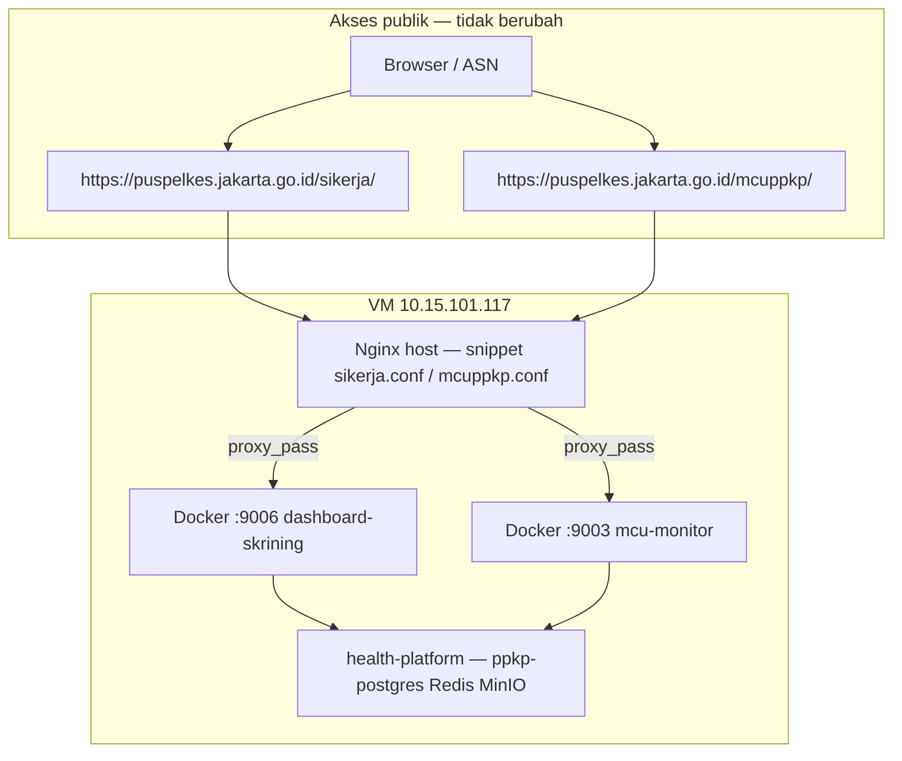

# Workflow deploy produksi — subdomain, PostgreSQL, dan update rutin

Panduan ini menjawab pertanyaan umum setelah migrasi **MySQL → PostgreSQL (health-platform)**:

- Apakah **subdomain** (`/sikerja/`, `/mcuppkp/`) masih jalan?
- Apakah workflow **`git pull` + `update-production.sh`** tetap sama?
- Apa yang **hanya dilakukan sekali** vs **setiap deploy**?

Dokumen ini melengkapi [PRODUCTION.md](./PRODUCTION.md) (instalasi infra) dan panduan deploy per aplikasi.

---

## Ringkasan (TL;DR)

| Aspek | Setelah migrasi PG |
|--------|-------------------|
| URL publik / subdomain | **Tidak berubah** — nginx host VM tidak disentuh migrasi DB |
| Port Docker (`9006`, `9003`) | **Sama** — dari `APP_PORT` di `.env` |
| Deploy harian | `git pull` → `./deploy/update-production.sh` (per repo app) |
| `update-production.sh` | **Tidak** menimpa `.env` |
| health-platform | Setup **sekali**; tidak perlu `git pull` tiap update aplikasi |
| Database | PostgreSQL di `ppkp-postgres`; MySQL legacy bisa di-stop |

---

## Arsitektur lapisan

Migrasi hanya mengganti **lapisan database**. Yang di atas dan di bawahnya tetap:



| Lapisan | Repo / path | Diubah saat migrasi? |
|---------|-------------|----------------------|
| Nginx host | `/etc/nginx/snippets/` | **Tidak** |
| Aplikasi Laravel | `dashboard-skrining`, `mcu-monitor` | Kode via `update-production.sh` seperti biasa |
| `.env` URL & port | `.env` di masing-masing app | **Pertahankan** — hanya tambah `PGSQL_*` |
| Database | `health-platform` → PostgreSQL | **Ya** (sekali) |

---

## Tiga repo — peran masing-masing

| Repo | Path VM (contoh) | Kapan di-update |
|------|------------------|-----------------|
| **health-platform** | `/opt/health-platform` | Sekali saat setup PG; sesekali jika infra berubah |
| **dashboard-skrining** | `/var/www/html/dashboard-skrining` | **Setiap** release: `git pull` + `update-production.sh` |
| **mcu-monitor** | `/var/www/html/mcu-monitor` | **Setiap** release: `git pull` + `update-production.sh` |

---

## Fase 1 — Sebelum cutover (wajib)

### 1.1 Backup penuh

```bash
cd /opt/health-platform
export DASHBOARD_ROOT=/var/www/html/dashboard-skrining
export MCU_ROOT=/var/www/html/mcu-monitor
./infrastructure/backup/backup-pre-cutover.sh
```

Salin folder `storage/backups/pre-cutover-*` ke NAS/laptop.

Detail: [PRODUCTION.md — Cadangan penuh](./PRODUCTION.md#cadangan-penuh-sebelum-implementasi-wajib)

### 1.2 Catat `.env` produksi yang aktif

**Jangan** mengandalkan `.env.production.example` untuk cutover. Simpan salinan `.env` lama:

```bash
cp /var/www/html/dashboard-skrining/.env ~/backup-env-dashboard-$(date +%F)
cp /var/www/html/mcu-monitor/.env ~/backup-env-mcu-$(date +%F)
```

### 1.3 Variabel yang wajib dipertahankan (subdomain & sesi)

Edit cutover = **tambah PG**, bukan ganti URL:

**Dashboard (`dashboard-skrining/.env`):**

```env
APP_URL=https://puspelkes.jakarta.go.id/sikerja
ASSET_URL=https://puspelkes.jakarta.go.id/sikerja
APP_SUBPATH=/sikerja
SESSION_PATH=/sikerja/
SESSION_SECURE_COOKIE=true
APP_PORT=9006
APP_USE_REQUEST_URL=false
TRUSTED_PROXIES=127.0.0.1,10.0.0.0/8,172.16.0.0/12
APP_KEY=base64:...    # JANGAN diganti
```

**MCU (`mcu-monitor/.env`):**

```env
APP_URL=https://puspelkes.jakarta.go.id/mcuppkp
ASSET_URL=https://puspelkes.jakarta.go.id/mcuppkp
SESSION_PATH=/mcuppkp/
SESSION_SECURE_COOKIE=true
APP_PORT=9003
APP_USE_REQUEST_URL=false
APP_KEY=base64:...    # JANGAN diganti
```

**Yang ditambahkan / diubah untuk PostgreSQL:**

```env
DB_CONNECTION=pgsql
PGSQL_HOST=sikerja-postgres          # dashboard — alias DNS di network ppkp-data
# PGSQL_HOST=mcu-monitor-postgres    # MCU
PGSQL_PORT=5432
PGSQL_DATABASE=sikerja_ppkp          # atau mcu_monitor
PGSQL_USERNAME=sikerja               # atau mcu_monitor
PGSQL_PASSWORD=<sama health-platform>
PGSQL_SSLMODE=prefer
```

Password harus sinkron:

| health-platform `.env` | App `.env` |
|------------------------|------------|
| `DASHBOARD_DB_PASSWORD` | `PGSQL_PASSWORD` (dashboard) |
| `MCU_DB_PASSWORD` | `PGSQL_PASSWORD` (MCU) |

---

## Fase 2 — Cutover sekali (maintenance window)

Urutan lengkap ada di [PRODUCTION.md](./PRODUCTION.md). Ringkas:

```bash
# 1. Infra PG (sekali)
cd /opt/health-platform
./scripts/install-production.sh

# 2. Dashboard — migrasi data + cutover .env
cd /var/www/html/dashboard-skrining
# Edit .env: DB_CONNECTION=pgsql, PGSQL_* (pertahankan APP_URL dll.)
docker compose -f docker-compose.yml -f docker-compose.prod.yml exec app \
  php artisan migrate --database=pgsql --force
docker compose -f docker-compose.yml -f docker-compose.prod.yml exec app \
  php artisan sikerja:migrate-mysql-to-pgsql --fresh --verify
./deploy/update-production.sh

# 3. MCU — sama
cd /var/www/html/mcu-monitor
docker compose --profile mysql-legacy up -d mysql   # sumber migrasi
docker compose -f docker-compose.yml -f docker-compose.prod.yml exec app \
  php artisan migrate --database=pgsql --force
docker compose -f docker-compose.yml -f docker-compose.prod.yml exec app \
  php artisan mcu:migrate-mysql-to-pgsql --fresh --verify
docker compose -f docker-compose.yml -f docker-compose.prod.yml exec app \
  php artisan mcu:fix-pgsql-sequences
./deploy/update-production.sh

# 4. Bridge — UI: generate API key CKG → tempel MCU
docker compose -f docker-compose.yml -f docker-compose.prod.yml exec app \
  php artisan ckg-bridge:verify

# 5. Stop MySQL legacy (opsional, setelah verify)
docker compose --profile mysql-legacy stop mysql
```

### Checklist setelah cutover

- [ ] `curl -fsS http://127.0.0.1:9006/up` OK
- [ ] `curl -fsS http://127.0.0.1:9003/up` OK
- [ ] Login HTTPS subdomain — CSS/JS tampil
- [ ] Data sesuai (jumlah peserta/sesi)
- [ ] `ckg-bridge:verify` OK
- [ ] Backup: `./infrastructure/backup/backup-and-archive.sh` (PG → MinIO)

---

## Fase 3 — Deploy rutin (setiap update kode)

**Ini workflow yang sudah Anda pakai — tidak berubah setelah migrasi PG.**

### Dashboard Skrining

```bash
cd /var/www/html/dashboard-skrining
git pull origin sistem-ppkp-terintegrasi   # atau branch DEPLOY_BRANCH Anda
./deploy/update-production.sh
```

### MCU Monitor

```bash
cd /var/www/html/mcu-monitor
git pull origin main                       # atau branch DEPLOY_BRANCH Anda
./deploy/update-production.sh
```

### Apa yang dilakukan `update-production.sh`

| Langkah | Keterangan |
|---------|------------|
| `git pull` | Ambil kode terbaru (jika repo git) |
| `build-frontend.sh` | Build Vite di host |
| `docker compose build app` | Rebuild image (wajib untuk perubahan PHP/view/CSS) |
| `docker compose up -d` | Restart stack |
| `php artisan migrate --force` | Schema DB (PostgreSQL) |
| `config:cache` / `route:cache` / `view:cache` | Optimasi Laravel |
| Health check | `curl http://127.0.0.1:APP_PORT/up` |
| **Tidak dilakukan** | Menimpa `.env`, ubah nginx host, migrasi MySQL→PG |

MCU tambahan: `ckg-bridge:verify --warn-only` (read-only).

### Yang tidak perlu setiap deploy

- `git pull` di **health-platform** (kecuali update infra)
- `migrate-mysql-to-pgsql` / `--fresh`
- Ubah snippet nginx (kecuali path/port berubah)
- Salin ulang `.env` dari `.env.production.example`

---

## Port lokal = port produksi

Anda menyamakan port Docker lokal dan VM — pola yang benar:

| App | `APP_PORT` | Nginx proxy ke |
|-----|------------|----------------|
| dashboard-skrining | `9006` | `127.0.0.1:9006` |
| mcu-monitor | `9003` | `127.0.0.1:9003` |

File `docker-compose.prod.yml` **tidak** mengubah port publish; yang menentukan adalah `APP_PORT` di `.env`.

Setelah migrasi PG, pastikan `docker-compose.prod.yml` tetap dipakai:

```bash
docker compose -f docker-compose.yml -f docker-compose.prod.yml ps
```

---

## Nginx host & subdomain

Snippet yang sudah terpasang di VM **tidak perlu diubah** untuk migrasi database.

| Path publik | Snippet | Backend |
|-------------|---------|---------|
| `/sikerja/` | `/etc/nginx/snippets/sikerja.conf` | `127.0.0.1:9006` |
| `/mcuppkp/` | `/etc/nginx/snippets/mcuppkp.conf` | `127.0.0.1:9003` |

Instal ulang snippet hanya jika VM baru atau nginx direset:

```bash
# Dashboard
cd /var/www/html/dashboard-skrining
./deploy/install-nginx-snippet.sh

# MCU
cd /var/www/html/mcu-monitor
./deploy/install-nginx-snippet.sh
sudo nginx -t && sudo systemctl reload nginx
```

---

## Backup setelah produksi PG

```bash
cd /opt/health-platform
./infrastructure/backup/backup-and-archive.sh
# Arsip di MinIO: bucket minio.sikerja → pg-backups/YYYY-MM-DD/
```

Cron contoh (03:30 harian):

```cron
30 3 * * * cd /opt/health-platform && ./infrastructure/backup/backup-and-archive.sh >> storage/logs/backup-minio.log 2>&1
```

Backup aplikasi (opsional, tambahan):

```bash
docker compose exec -T app php artisan sikerja:backup-database   # dashboard
docker compose exec -T app php artisan mcu:backup-database     # MCU
```

---

## Rollback jika cutover gagal

```bash
cd /opt/health-platform
export BACKUP_RESTORE_YES=1
./infrastructure/backup/restore-pre-cutover.sh storage/backups/pre-cutover-YYYYMMDD-HHMMSS
```

Kemudian verifikasi subdomain seperti biasa (`update-production.sh` jika perlu sinkron kode).

---

## Troubleshooting

### Subdomain 404 atau CSS hilang setelah `update-production.sh`

Biasanya **bukan** masalah PostgreSQL — cek `.env` URL:

```bash
# Dashboard
cd /var/www/html/dashboard-skrining
./deploy/set-portal-env.sh
docker compose -f docker-compose.yml -f docker-compose.prod.yml exec app php artisan config:cache

# MCU
cd /var/www/html/mcu-monitor
./deploy/set-domain-env.sh
docker compose -f docker-compose.yml -f docker-compose.prod.yml exec app php artisan config:cache

sudo nginx -t && sudo systemctl reload nginx
```

### `network ppkp-data not found`

```bash
cd /opt/health-platform && ./scripts/install-production.sh
```

`update-production.sh` memanggil `ensure_ppkp_data_network` — health-platform harus jalan.

### `password authentication failed` (PostgreSQL)

Samakan `PGSQL_PASSWORD` app dengan `DASHBOARD_DB_PASSWORD` / `MCU_DB_PASSWORD` di health-platform.

### Bridge gagal setelah migrasi

1. `php artisan mcu:fix-pgsql-sequences` (MCU)
2. Generate ulang API key di UI CKG → tempel MCU
3. `php artisan ckg-bridge:verify`

Panduan: `mcu-monitor/docs/BRIDGE-AFTER-PG-MIGRATION.md`

### Perubahan UI tidak muncul setelah `git pull`

`git pull` saja **tidak cukup** — wajib:

```bash
./deploy/update-production.sh
# atau rebuild penuh:
DOCKER_BUILD_NO_CACHE=1 ./deploy/update-production.sh
```

---

## Perintah cepat (cheat sheet)

```bash
# Status
docker compose -f docker-compose.yml -f docker-compose.prod.yml ps
curl -fsS http://127.0.0.1:9006/up
curl -fsS http://127.0.0.1:9003/up

# Deploy update (rutin)
cd /var/www/html/dashboard-skrining && git pull && ./deploy/update-production.sh
cd /var/www/html/mcu-monitor && git pull && ./deploy/update-production.sh

# Verify PG counts (sekali / audit)
docker compose exec app php artisan sikerja:migrate-mysql-to-pgsql --verify
docker compose exec app php artisan mcu:migrate-mysql-to-pgsql --verify

# Bridge
docker compose exec app php artisan ckg-bridge:verify
```

---

## Dokumen terkait

| Topik | File |
|-------|------|
| Instalasi infra VM | [PRODUCTION.md](./PRODUCTION.md) |
| Setup dari nol (lokal) | [SETUP-FROM-SCRATCH.md](./SETUP-FROM-SCRATCH.md) |
| Penamaan DB & env | [DATABASE-NAMING.md](./DATABASE-NAMING.md), [APP-ENV.md](./APP-ENV.md) |
| Deploy dashboard detail | `dashboard-skrining/docs/DEPLOY.md` |
| Deploy MCU detail | `mcu-monitor/docs/DEPLOY.md` |
| Migrasi PG dashboard | `dashboard-skrining/docs/MIGRATE-MYSQL-TO-POSTGRESQL.md` |
| Migrasi PG MCU | `mcu-monitor/docs/MIGRATE-MYSQL-TO-POSTGRESQL.md` |
| Bridge setelah PG | `mcu-monitor/docs/BRIDGE-AFTER-PG-MIGRATION.md` |
| Backup MinIO | [LOCAL.md](./LOCAL.md) (Windows), [PRODUCTION.md](./PRODUCTION.md) (MinIO) |
